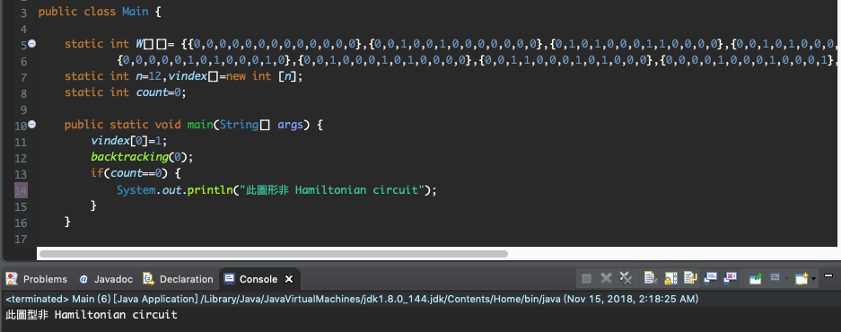

## 說明
漢米爾頓迴路(Hamiltonian circuit)，是一條由某個起始節點出發，經過每個節點恰好一次，且最後會回到起始節點的路徑(path)。

### main() 函式與建立相鄰矩陣
首先建立相鄰矩陣 W 為二維陣列，分別儲存每一點到任何一點的連接關係，以及建立陣列 vindex 來存取該點是否在遞迴中被走過，在 main 主函式中先將陣列vindex設定起始點，接著呼叫 backtracking() 函式來進行回溯走訪每個可能點。
其中最後的 count 變數是判斷該圖形是否為漢米爾頓迴路，若無路徑則會印出提示訊息。

```java
	static int W[][]= {{0,0,0,0,0,0,0,0,0,0,0,0,0},{0,0,1,0,0,1,0,0,0,0,0,0,0},{0,1,0,1,0,0,0,1,1,0,0,0,0},{0,0,1,0,1,0,0,0,1,0,0,0,0},{0,0,0,1,0,0,0,0,0,1,0,0,0},{0,1,0,0,0,0,1,0,0,0,1,0,0},
			{0,0,0,0,0,1,0,1,0,0,0,1,0},{0,0,1,0,0,0,1,0,1,0,0,0,0},{0,0,1,1,0,0,0,1,0,1,0,0,0},{0,0,0,0,1,0,0,0,1,0,0,0,1},{0,0,0,0,0,1,0,0,0,0,0,1,0},{0,0,0,0,0,0,1,0,0,0,1,0,1},{0,0,0,0,0,0,0,0,0,1,0,1,0}};
	static int n=12,vindex[]=new int [n];
	static int count=0;

	public static void main(String[] args) {
		vindex[0]=1;
		backtracking(0);
		if(count==0) {
			System.out.println("此圖形非 Hamiltonian circuit");
		}
  }
  ```

### backtracking()函式
此函式主要是進行遞迴回溯方式來走訪每個可能點，首先判斷該點是否promising若promising為1代表有路走，接著進入程式首先判斷否繞回起點了，若有則依序的印出某一條可能路線，若還尚未繞回起點則繼續遞迴來尋找所有路線，即呼叫backtracking(i+1)。

```java
public static void backtracking(int i) {
		int j;
		if(promising(i)==1) { // 若promising代表有路走
			if(i==n-1) { // 判斷是否繞回起點了，若有則印出答案
				for(int k=0;k<n;k++) {
					System.out.print(vindex[k]+" ");
				}
				System.out.println();
				count++;
			}else { // 尋找所有路線
				for(j=2;j<=n;j++) {
					vindex[i+1]=j;
					backtracking(i+1);
				}
			}
		}
  }
```

### promising()函式
promising函式是判斷該點以下是否有路徑可走，若無則會回傳0即可省略後面的遞迴走訪，第一個判斷式if是判斷起始點點是否與第(n−1)點相鄰，第二個判斷式為判斷第(n−1)個點是否與最後一點相鄰，以上成立則會回傳0代表無需繼續走上下去，接下來最後一個判斷式是迴圈依序檢查陣列vindex中該點是否已經被走過，若走過則回傳0，反之1。


```java
public static int promising(int i) {
		int j,choose;
		if(i==n-1&& W[vindex[n-1]][vindex[0]]==0) // 起始點點是否與第(n−1)點相鄰
			choose=0;
		else if(i>0&&W[vindex[i-1]][vindex[i]]==0) // 第(n−1)個點是否與最後一點相鄰
			choose=0;
		else {
			choose=1;
			j=1;
			while(j<i&&choose==1) { // 檢查陣列vindex中該點是否已經被走過
				if(vindex[i]==vindex[j])
					choose=0;
				j++;
			}
		}
		return choose;
  }
```

## 測試與執行 
- 測試一


- 測試二


